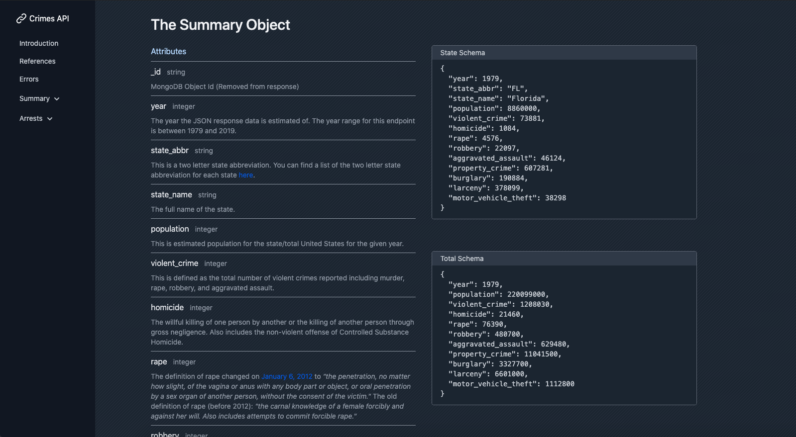

# Crime Data API

A Crimes Data REST API is focused around delivering U.S. Crime data from various datasources. Government data and websites are notoriously difficult to navigate and find specific data. This Crime data API has simple and understandable endpoints combined with straightforward documentation to understand each endpoint and field. Additionally allowing users to filter for crimes or offenses they are specifically looking for.

I aimed to make the documentation as readible and understandable as possible. Enjoy!

[Click here to see the documentation](https://crimedata-mern.vercel.app/)

References:
  * https://nodejs.org/en/

